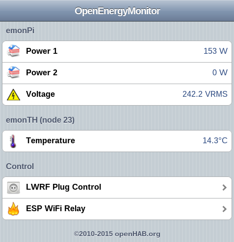

# OpenEnergyMonitor skeleton config for openHAB

## [Read The Blog Post](https://blog.openenergymonitor.org/2015/12/openenergymonitor-emonpi-and-openhab/)

***



# To install openHab on emonPi / Raspberry Pi:

## Install Java

Check Java version (JVM 1.6 is required but 8 is recommended, see update below):

	$ java -version
	
Install if needed:

~~	$ sudo apt-get install oracle-java7-jdk
	
**Update Sep 16:**

**Java 8** is now needed to connect to My.OpenHAB, see [forum thread](https://community.openenergymonitor.org/t/openhab-problems-connecting-through-myopenhab-with-java-8/1232). Instructions to upgrade to java 8 and obtain automatic java updates in the future are as follows, see [openHAB forum thread](https://community.openhab.org/t/my-openhab-org-is-online-ios-app-doesnt-show-sitemap-solution-java-update/12858/13):

```
sudo su
echo "deb http://ppa.launchpad.net/webupd8team/java/ubuntu xenial main" | tee /etc/apt/sources.list.d/webupd8team-java.list
echo "deb-src http://ppa.launchpad.net/webupd8team/java/ubuntu xenial main" | tee -a /etc/apt/sources.list.d/webupd8team-java.list
apt-key adv --keyserver hkp://keyserver.ubuntu.com:80 --recv-keys EEA14886
apt-get update
apt-get install oracle-java8-installer
exit
```
**Note the install guide on this page is for OpenHAB1, to install openHAB2 follow [this forum thread](https://community.openenergymonitor.org/t/install-openhab2-on-emonsd-emonpi/1741/12?u=glyn.hudson)***

## Install OpenHab 1 
	
	$ rpi-rw
	$ wget -qO - 'https://bintray.com/user/downloadSubjectPublicKey?username=openhab' |sudo apt-key add -
	$ echo "deb http://dl.bintray.com/openhab/apt-repo stable main" | sudo tee /etc/apt/sources.list.d/openhab.list
	$ sudo apt-get update
	$ sudo apt-get install openhab-runtime
	$ sudo /etc/init.d/openhab start

To run openHab at startup:

	sudo systemctl daemon-reload
	sudo systemctl enable openhab
	sudo nano /etc/rc.local
	
add

	/etc/init.d/openhab start

before 'exit 0'

# Install MQTT & HTTP Bindings

	sudo apt-get install openhab-addon-binding-mqtt
	sudo apt-get install openhab-addon-binding-http


# Install the OpenEnergyMonitor config files:

	$ git clone https://github.com/openenergymonitor/oem_openHab
	$ sudo ln -s /home/pi/oem_openHab/openhab.cfg /etc/openhab/configurations/
	$ sudo ln -s /home/pi/oem_openHab/oem.items /etc/openhab/configurations/items/default.items
	$ sudo ln -s /home/pi/oem_openHab/oem.sitemap /etc/openhab/configurations/sitemaps/default.sitemap
	$ sudo /etc/init.d/openhab restart

Then browse to:

	http://IP_ADDRESS:8080

You might need to open up the port:

	sudo ufw allow 8080/tcp

	
# Enable Authentication

	sudo nano /etc/openhab/configurations/openhab.cfg
Change:
	security:option=ON 
	
or to only enable authentication required for external connections 
	
	security:option=EXTERNAL 

You might also need to set netmask to indicate requests from your local network, this setting defaults to `192.168.1.0/24`, however my home network uses 192.168.0.XX addresses, therfore I needed to set: 

	security:netmask=192.168.0.0/24
	
Add authentication details:

	sudo nano /etc/openhab/configurations/users.cfg
	
Add "user=password" to users.cfg

	pi = emonpi2016
	
# Read-only filesystem

If you want to run openHAB on emonPi with read-only file system you will need to mount /var/lib/openhab as tempfs in RAM
	
	$ sudo sh -c "echo 'tmpfs           /var/lib/openhab   tmpfs   nodev,nosuid,size=20M,mode=1777        0    0' >> /etc/fstab"
	
Also the correct ports will ned to be opend and RAM tmpfs log file created on startup. At the following to /etc/rc.local
	
	sudo iptables -A INPUT -p tcp -m tcp --dport 8080 -j ACCEPT
	sudo mkdir /var/log/openhab
	sudo chmod 666 /var/log/openhab
	/etc/init.d/openhab start
	
# Debugging

View log:

	$ tail /var/log/openhab/openhab.log
	$ tail /var/log/openhab/event.log
		
To enable verbose debug mode cheange debug to 'yes' in:

	sudo nano /etc/default/openhab
	
Note: it's not recomended to leave debug turned on by default as its very verbose and will fill up your logs!

By default openHAB logs all events to  /var/log/openhab/event.log, this is very verbose and filles up /var/log quickly as events also appear in syslog and daemon log. To disable event log:

	sudo nano /etc/openhab/logback.xml

Change "runtime.busevents" loglevel from "INFO" to "WARN"

	<logger name="runtime.busevents" level="WARN" additivity="false">
	
The number of log archives that openHAB keeps can also be reduced by editing `/etc/openhab/logback.xml` and `/etc/openhab/logback_debug.xml` On emonPi opneHAB has been set to keep only a single log archive as oposed the the default 30!

# Disable Request log 

OpenHAB uses a Jetty server which generates it's own request logs in `var/log/openhab` which annoyingly are date stamped filenames so they get missed by log rotate. Disable request log by editing 

`sudo nano /etc/openhab/jetty/etc/jetty.xml`


and commenting out the request log handler e.g.

```
<!--<Item>
             <New id="RequestLog" class="org.eclipse.jetty.server.handler.RequestLogHandler"/>
           </Item>-->
```

and in the same file comment out the request log config

```
   <!-- <Ref id="RequestLog">
      <Set name="requestLog">
        <New id="RequestLogImpl" class="org.eclipse.jetty.server.NCSARequestLog">
          <Set name="filename"><SystemProperty name="jetty.logs" default="./logs"/>/yyyy_mm_dd.request.log</Set>
          <Set name="filenameDateFormat">yyyy_MM_dd</Set>
          <Set name="retainDays">90</Set>
          <Set name="append">true</Set>
          <Set name="extended">false</Set>
          <Set name="logCookies">false</Set>
          <Set name="LogTimeZone">GMT</Set>
        </New>
      </Set>
    </Ref> -->
```
	
# Remote Access

There are two options to access openHAB remotly: 

## 1. Direct Access
To access openHAB remotly you will need to open port 8080 on your router. If you have a dynamic IP you will need to setup a Dynamic DNS service such as [DuckDNS](https://www.duckdns.org/install.jsp) or [NoIP](http://www.noip.com/support/knowledgebase/install-ip-duc-onto-raspberry-pi/).

## 2. OpenHab cloud

OpenHab have made remote access easier by provding a cloud service: [my.openHAB.org](https://my.openhab.org/). For fully setup inf see [my.openhab docs](https://my.openhab.org/docs). Steps required for emonPi are listed below: 

	sudo apt-get install openhab-addon-io-myopenhab
	sudo service openhab restart
	
Generate new UUID that will be unique to your OpenHAB installation

	sudo service openhab stop
	sudo rm -rf /usr/share/openhab/webapps/static/uuid 
	sudo service openhab start
	
###Create account on [my.openHAB.org](https://my.openhab.org/) using newly generated `UUID` and `secret` from:
Create account on [myopenHAB.org](https://myopenhab.org/) using newly generated `UUID` and `secret` from:

	cat /usr/share/openhab/webapps/static/uuid
	cat /usr/share/openhab/webapps/static/secret

Browse to:

###https://my.openhab.org/openhab.app
https://myopenhab.org/openhab.app

***


## Make toggle switch state reflect the actual status

E.g. make the toggle on/off switch of the MQTT WiFi relay reflect the ACTUAL state of the relay by reading the state MQTT topic


**Items entry**

`Switch relay1_mqtt "ESP8266 Relay 1 (MQTT)" {mqtt=">[mosquitto:heating/control/relay/1:command:ON:1],>[mosquitto:heating/control/relay/1:command:OFF:0],<[mosquitto:heating/status/relay/1:state:MAP(onoff.map)]", autoupdate="false"}`


**Add transformation file**

`sudo nano  /etc/openhab/configurations/transform/onoff.map`

Add:

```
0=OFF
1=ON
```


